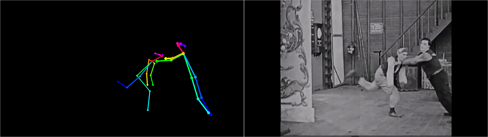

# Open-Pose and Tertiary qualities

# WIP

This project is a *work in progress*. The implementation is *incomplete* and subject to change. The documentation can be inaccurate.

# Brief

Open-Pose is a C++ library for real-time Multi-Person Keypoint Detection developed at the Carnegie Mellon University. As mentioned at its project repository [https://github.com/CMU-Perceptual-Computing-Lab/openpose](https://github.com/CMU-Perceptual-Computing-Lab/openpose):

OpenPose represents the first real-time system to jointly detect human body, hand and facial keypoints (in total 130 keypoints) on single images. In addition, the system computational performance on body keypoint estimation is invariant to the number of detected people in the image.

The published article by its authors is at:

       Realtime Multi-Person 2D Pose Estimation using Part Affinity Fields
          at https://arxiv.org/abs/1611.08050
          Authors: Zhe Cao, Tomas Simon, Shih-En Wei, Yaser Sheikh
          Date: Submitted on 24 Nov 2016 (v1), last revised 14 Apr 2017 (v2)

This project is using this library for tertiary artistic qualities, mainly simplification and remotion of qualities in the real-time videos as to get an abstract artistic form.

# Examples

The first example is from a scene of the movie ["Back Stage", starring Fatty Arbuckle and Buster Keaton (1919)](https://en.wikipedia.org/wiki/Back_Stage_(1919_film)), when the dancer Jack Coogan enters into the theater and Buster Keaton, Al St. John, and Roscoe Arbuckle meet him. The scene is at [https://www.youtube.com/watch?v=tYL0VjaCAUY](https://www.youtube.com/watch?v=tYL0VjaCAUY). The result of the using Open-Pose to find Tertiary artistic qualities is at [result_1919_Arbuckle_Buster_Keaton_Back_Stage.avi](result_1919_Arbuckle_Buster_Keaton_Back_Stage.avi) in this repository.

